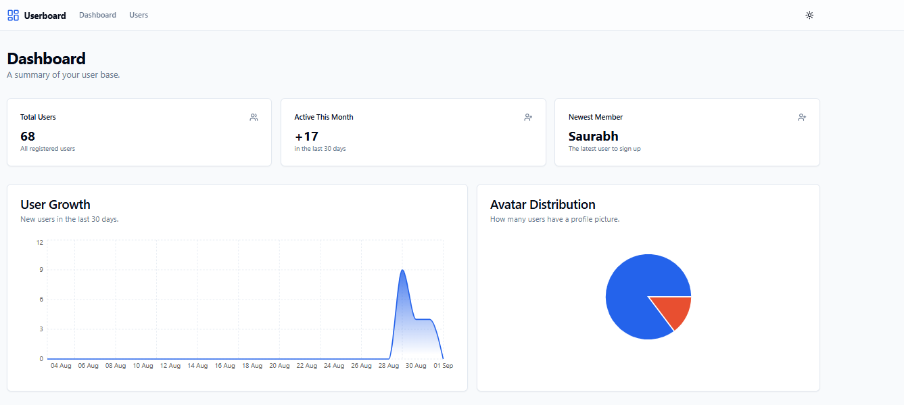

# 📊 User Management Dashboard

A modern, responsive, and feature-rich user dashboard built with Next.js, TypeScript, and Tailwind CSS. This application fetches user data from a mock API and presents it through interactive charts and a fully functional, paginated user list.

---

### ✨ Live Demo & Screenshot

**[➡️ View Live Demo](https://user-dash-board-project.vercel.app/)




## ⭐ Features

-   **📱 Fully Responsive Design:** A mobile-first approach ensures a seamless experience on all devices, from phones to desktops.
-   **🎨 Modern Theming:**
    -   Built with the beautiful and accessible **`shadcn/ui`** component library.
    -   Vibrant, custom **blue color theme**.
    -   **Light & Dark Mode** toggle for user preference.
-   **📈 Interactive Dashboard (`/`)**
    -   At-a-glance KPI cards for Total Users, Active Users, and Newest Member.
    -   **User Growth Chart:** A gradient area chart showing new user signups over the last 30 days.
    -   **Avatar Distribution Chart:** A colorful pie chart visualizing the percentage of users with a profile picture.
    -   **Recently Joined List:** A clean, professional list of the 5 newest users.
-   **👥 User Management Page (`/users`)**
    -   **In-Memory Pagination:** Efficiently handles large user lists with "Previous" and "Next" controls.
    -   **Live Search:** Instantly filters users by name or email across the entire dataset.
    -   **Dynamic Sorting:** Clickable table headers to sort users by name, email, or join date.
    -   **User Details Modal:** Click on any user row to view their details in a sleek pop-up modal.

---

## 🛠️ Tech Stack

-   **Framework:** [Next.js](https://nextjs.org/) (with App Router)
-   **Language:** [TypeScript](https://www.typescriptlang.org/)
-   **Styling:** [Tailwind CSS](https://tailwindcss.com/)
-   **UI Components:** [shadcn/ui](https://ui.shadcn.com/)
-   **Charting:** [Recharts](https://recharts.org/)
-   **Data Fetching:** [Axios](https://axios-http.com/)
-   **Theming:** [next-themes](https://github.com/pacocoursey/next-themes)
-   **Icons:** [Lucide React](https://lucide.dev/)

---

## 🚀 Getting Started

Follow these instructions to get the project up and running on your local machine.

### Prerequisites

-   [Node.js](https://nodejs.org/) version 20.x or newer.
-   [npm](https://www.npmjs.com/) or your preferred package manager.

### Installation & Running

1.  **Clone the repository:**
    ```bash
    git clone [https://github.com/BhumiZalte12/User-DashBoard-Project](https://github.com/BhumiZalte12/User-DashBoard-Project.git)
    cd User-DashBoard-Project
    ```

2.  **Install dependencies:**
    ```bash
    npm install
    ```

3.  **Run the development server:**
    ```bash
    npm run dev
    ```

4.  Open [http://localhost:3000](http://localhost:3000) in your browser to see the result.

---

## 部署 (Deployment)

The easiest way to deploy this Next.js application is to use the [Vercel Platform](https://vercel.com/new).

-   Push your code to a GitHub repository.
-   Import the repository into Vercel.
-   Vercel will automatically detect that this is a Next.js project and deploy it with zero configuration.